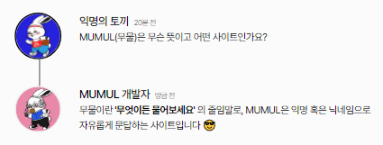

<div align="center">


[](https://hits.seeyoufarm.com)

</div>

# MUMUL
> **서울여자대학교 소프트웨어융합학과 2명의 학부생이 만든 사이드 프로젝트** <br/> **개발기간: 2023.04 ~ 2023.07**

## 배포 주소

> **개발 버전** : [https://mumul.space](https://mumul.space) <br>


## 웹개발팀 소개

|      최은영       |          노수진                                                                                                                           
| :------------------------------------------------------------------------------: | :---------------------------------------------------------------------------------------------------------------------------------------------------: | 
|       |                          |                  
|   [@silver0-stack](https://github.com/silver0-stack)   |    [@suucong](https://github.com/suucong)  | 
| 서울여자대학교 소프트웨어학과 4학년 | 서울여자대학교 소프트웨어학과 3학년 | 

## 프로젝트 소개

서울여자대학교 소프트웨어융합학과 학부생 2명이 제작한 Ask Me Anything(A.K.A AMA) 커뮤니티 서비스입니다. 

MUMUL은 **'사람과 사람을 잇다'** 라는 핵심 가치 아래 개발되었습니다.  누구나 자유롭게 질문함으로써 소통합니다. 개인적인, 공개적인, 전문적인, 비전문적인 것을 가리지 않고 아울러 다루는 [MUMUL 무물(무엇이든 물어보세요)에서 스페이스를 시작하세요](https://mumul.space) ✨

누구나 익명의 토끼🐰 혹은 본인의 닉네임으로 질문받는 자의 스페이스에서 자유롭게 질문할 수 있습니다. 그리고 질문받은 자는 공개 혹은 비공개 답변(질문자와 답변자만 확인 가능)으로 답변 확인 권한을 선택해서 답변할 수 있습니다.

서비스가 제공하는 기능은 다음과 같습니다.

- 구글, 카카오톡 이메일로 소셜 로그인
- 익명 혹은 본인의 닉네임으로 질문 등록
- 공개 혹은 비공개 답변 등록
- 본인의 스페이스에서 받은 질문 삭제 가능(논란의 여지가 있는 질문은 스페이스 주인이 삭제 가능)
- 스페이스 팔로우 기능 → 이동한 스페이스의 팔로워, 팔로잉 목록 확인 가능
- 이메일 알림 기능 → 본인 스페이스에 질문 혹은 답변이 달리면 로그인한 이메일로 푸시 이메일 발송
- 본인 스페이스 중지 기능 → 질문받는 기능, 팔로우 기능 중지
- 회원 탈퇴 기능

## 시작 가이드
### Requirements
For building and running the application you need:

- [Node.js 14.19.3](https://nodejs.org/ca/blog/release/v14.19.3/)
- [Npm 9.2.0](https://www.npmjs.com/package/npm/v/9.2.0)
- [Strapi 3.6.6](https://www.npmjs.com/package/strapi/v/3.6.6)

### Installation
``` bash
$ git clone https://github.com/Voluntain-SKKU/Voluntain-2nd.git
$ cd Voluntain-2nd
```
#### Backend
```
$ cd strapi-backend
$ nvm use v.14.19.3
$ npm install
$ npm run develop
```

#### Frontend
```
$ cd voluntain-app
$ nvm use v.14.19.3
$ npm install 
$ npm run dev
```

---

## Stacks 🐈

### Environment


             

### Config
      

### Development


### Communication


---
## 화면 구성 📺
| 메인 페이지  |  소개 페이지   |
| :-------------------------------------------: | :------------: |
|   |  |  
| 강좌 소개 페이지   |  강의 영상 페이지   |  
|    |       |

---
## 주요 기능 📦

### ⭐️ 익명 혹은 본인의 닉네임으로 질문 등록
- 익명의 토끼🐰 과 본인 닉네임 중에서 선택해서 스페이스에 질문을 남길 수 있음

### ⭐️ 공개 혹은 비공개 답변 등록
- 공개 답변과 질문자에게만 공개 답변 중에서 선택해서 질문에 답변을 남길 수 있음

### ⭐️ 팔로우하기
- 팔로우하고 싶은 스페이스를 팔로우 할 수 있음

---
## 아키텍쳐

### 디렉토리 구조
```bash
├── README.md
├── package-lock.json
├── package.json
├── strapi-backend : 
│   ├── README.md
│   ├── api : db model, api 관련 정보 폴더
│   │   ├── about
│   │   ├── course
│   │   └── lecture
│   ├── config : 서버, 데이터베이스 관련 정보 폴더
│   │   ├── database.js
│   │   ├── env : 배포 환경(NODE_ENV = production) 일 때 설정 정보 폴더
│   │   ├── functions : 프로젝트에서 실행되는 함수 관련 정보 폴더
│   │   └── server.js
│   ├── extensions
│   │   └── users-permissions : 권한 정보
│   ├── favicon.ico
│   ├── package-lock.json
│   ├── package.json
│   └── public
│       ├── robots.txt
│       └── uploads : 강의 별 사진
└── voluntain-app : 프론트엔드
    ├── README.md
    ├── components
    │   ├── CourseCard.js
    │   ├── Footer.js
    │   ├── LectureCards.js
    │   ├── MainBanner.js : 메인 페이지에 있는 남색 배너 컴포넌트, 커뮤니티 이름과 슬로건을 포함.
    │   ├── MainCard.js
    │   ├── MainCookieCard.js
    │   ├── NavigationBar.js : 네비게이션 바 컴포넌트, _app.js에서 공통으로 전체 페이지에 포함됨.
    │   ├── RecentLecture.js
    │   └── useWindowSize.js
    ├── config
    │   └── next.config.js
    ├── lib
    │   ├── context.js
    │   └── ga
    ├── next.config.js
    ├── package-lock.json
    ├── package.json
    ├── pages
    │   ├── _app.js
    │   ├── _document.js
    │   ├── about.js
    │   ├── course
    │   ├── index.js
    │   ├── lecture
    │   ├── newcourse
    │   ├── question.js
    │   └── setting.js
    ├── public
    │   ├── favicon.ico
    │   └── logo_about.png
    └── styles
        └── Home.module.css

```

<!--
```bash
├── README.md : 리드미 파일
│
├── strapi-backend/ : 백엔드
│   ├── api/ : db model, api 관련 정보 폴더
│   │   └── [table 이름] : database table 별로 분리되는 api 폴더 (table 구조, 해당 table 관련 api 정보 저장)
│   │       ├── Config/routes.json : api 설정 파일 (api request에 따른 handler 지정)
│   │       ├── Controllers/ [table 이름].js : api controller 커스텀 파일
│   │       ├── Models : db model 관련 정보 폴더
│   │       │   ├── [table 이름].js : (사용 X) api 커스텀 파일
│   │       │   └── [table 이름].settings.json : model 정보 파일 (field 정보)
│   │       └─── Services/ course.js : (사용 X) api 커스텀 파일
│   │ 
│   ├── config/ : 서버, 데이터베이스 관련 정보 폴더
│   │   ├── Env/production : 배포 환경(NODE_ENV = production) 일 때 설정 정보 폴더
│   │   │   └── database.js : production 환경에서 database 설정 파일
│   │   ├── Functions : 프로젝트에서 실행되는 함수 관련 정보 폴더
│   │   │   │   ├── responses : (사용 X) 커스텀한 응답 저장 폴더
│   │   │   │   ├── bootstrap.js : 어플리케이션 시작 시 실행되는 코드 파일
│   │   │   │   └── cron.js : (사용 X) cron task 관련 파일
│   │   ├── database.js : 기본 개발 환경(NODE_ENV = development)에서 database 설정 파일
│   │   └── server.js : 서버 설정 정보 파일
│   │  
│   ├── extensions/
│   │   └── users-permissions/config/ : 권한 정보
│   │ 
│   └── public/
│       └── uploads/ : 강의 별 사진
│
└── voluntain-app/ : 프론트엔드
    ├── components/
    │   ├── NavigationBar.js : 네비게이션 바 컴포넌트, _app.js에서 공통으로 전체 페이지에 포함됨.
    │   ├── MainBanner.js : 메인 페이지에 있는 남색 배너 컴포넌트, 커뮤니티 이름과 슬로건을 포함.
    │   ├── RecentLecture.js : 사용자가 시청 정보(쿠키)에 따라, 현재/다음 강의를 나타내는 컴포넌트 [호출: MainCookieCard]
    │   ├── MainCookieCard.js : 상위 RecentLecture 컴포넌트에서 전달받은 props를 나타내는 레이아웃 컴포넌트.
    │   ├── MainCard.js : 현재 등록된 course 정보를 백엔드에서 받아서 카드로 나타내는 컴포넌트 [호출: CourseCard]
    │   └── CourseCard.js : 상위 MainCard 컴포넌트에서 전달받은 props를 나타내는 레이아웃 컴포넌트
    │
    ├── config/
    │   └── next.config.js
    │
    ├── lib/
    │   └── ga/
    │   │   └── index.js
    │   └── context.js
    │
    ├── pages/
    │   ├── courses/
    │   │   └── [id].js : 강의 페이지
    │   ├── _app.js : Next.js에서 전체 컴포넌트 구조를 결정, 공통 컴포넌트(navbar, footer)가 선언되도록 customizing 됨.
    │   ├── _document.js : Next.js에서 전체 html 문서의 구조를 결정, lang 속성과 meta tag가 customizing 됨.
    │   ├── about.js : 단체 소개 페이지
    │   ├── index.js : 메인 페이지
    │   ├── question.js : Q&A 페이지
    │   └── setting.js : 쿠키, 구글 애널리틱스 정보 수집 정책 페이지
    │
    ├── public/
    │   ├── favicon.ico : 네비게이션바 이미지
    │   └── logo_about.png : about 페이지 로고 이미지
    │
    └── styles/
        └── Home.module.css

```
-->
